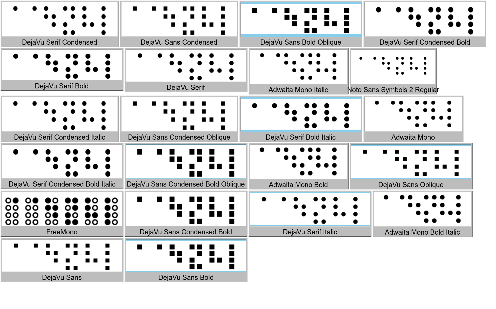
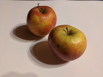

# print images to terminal


converts image files into monochrome unicode text utilizing the braille charset.


## usage

```help
usage: p.py [-h] [-m MODE] [-o FILE] [-f] [-d] [-y] [-z FACTOR | -x] [-v] [-a]
            [-b LEVEL] [-e FACTOR] [-D METH | --floyd] [-t NUM]
            FILE

rasterize an image into the terminal.

positional arguments:
  FILE                  path to input image file, or "-" to read from stdin.

options:
  -h, --help            show this help message and exit
  -m, --threshold MODE  threshold mode, allowed values:
                        [extremes|median|percentile|const|local] (default:
                        local)
  -o, --output FILE     output file (default: /dev/stdout).
  -f, --force           overwrite existing output file (default: True for
                        /dev/stdout).
  -d, --debug           preceed normal output with debug log printed to
                        /dev/stderr.
  -y, --crop-y          crop image to terminal height.
  -v, --invert          invert 'pixel' values of output.
  -a, --sharpen         enhance input image by emphasizing edges a little (the
                        more often the option gets repeated, the more).
  -b, --brightness LEVEL
                        adjust brightness in percent (default: 100).
  -t, --threshold-arg NUM
                        value to be passed to the threshold function (see the
                        --threshold option). required if selected threshold
                        mode is "percentile" or "const". threshold mode
                        "local" allows values between 0 and 9999.

resizing options:
  -z, --zoom FACTOR     factor by which input image should be scaled in size.
  -x, --fit-x           scale image so it fits into the terminal window
                        horizontally.

dithering options:
  -e, --dither FACTOR   error preservation factor/dithering ratio (default:
                        0).
  -D, --dmethod METH    dither method to use (one of atkinson|floyd-steinberg,
                        default: atkinson).
  --floyd               shortcut for -Dfloyd-steinberg
```


a font supporting the braille charset at codepoints `U+2800` through `U+28ff` is
required. here are some examples of fonts with braille glyphs and what they look
like:




## examples

example image:




basic usage:

```bash
python p.py eppels.png
```

```output
⣶⣷⣶⣶⣶⣶⡶⠖⠶⠶⢾⣿⣿⣶⣶⣶⣶⣶⣶⣶
⢸⣿⣿⣿⣿⡏⠀⣌⣤⣠⡆⢻⣿⣿⣿⣿⣿⣿⣿⡿
⣼⣿⡿⠟⠛⠃⣠⠨⠿⠛⠃⠞⡛⣛⠻⢿⣿⣿⣿⣵
⣿⣿⣥⣀⣀⠀⠈⠁⣀⡴⠀⠸⣿⣦⣄⣤⡎⢿⣿⣿
⠻⢿⣿⣿⣿⣿⠛⠉⠀⠁⠠⡀⠀⠈⠛⠏⠁⣸⣿⣿
⣺⣾⣿⣿⣿⣿⣦⣀⠀⠀⠀⠙⠂⠀⣀⣠⣴⣿⣿⣻
⣾⣿⠿⣿⣿⣿⣿⣿⣿⣶⣶⣶⣶⣿⣿⣿⣿⣿⢻⣽
```

read from stdin by passing `-` as the file argument:

```shell
cat eppels.png | python p.py -
```

```output
⢶⣷⣶⣶⣶⣶⣶⡶⠶⠶⠶⢶⣿⣿⣶⣶⣶⣶⣶⣶⣶⣶
⢺⣿⣿⣿⣿⣿⠋⠀⣁⣀⣀⡄⢻⣿⣿⣿⣿⣿⣿⣿⡿⢿
⣽⣿⣿⣿⠿⠿⠀⡀⣻⣿⠿⠃⡸⠿⠿⠿⣿⣿⣿⣿⣿⣷
⣿⣿⣏⠀⠀⠀⠈⠛⠄⠀⣠⠁⢰⣿⣗⡀⢀⢩⠻⣿⣿⣿
⣻⣿⣿⣿⣾⣶⣶⡶⠒⠛⠃⠀⠀⠙⠛⠿⣿⠿⠀⣿⣿⣿
⣺⣻⣿⣿⣿⣿⣧⡀⠀⠀⠀⠈⠲⡀⠀⠀⠀⠀⣰⣿⣿⣿
⣺⣿⣿⣿⣿⣿⣿⣮⣦⣄⣀⣀⣀⣀⣠⣴⣶⣿⣿⣿⣿⣶
```

this is useful for integrating with other command-line tools:

```shell
curl -s https://example.com/image.png | python p.py -
```


enable dithering but invert color values:

```bash
python p.py eppels.png -e.5 -v
```

```output
⢡⢊⡉⠍⡉⠉⢉⣩⣉⣉⡁⠌⠠⢉⠉⡉⢉⠉⡉⢉
⢂⠆⡘⠐⠀⢰⣿⠣⡛⠟⣹⡄⠡⢈⠐⠄⠡⠒⡐⠄
⠌⡐⢀⣥⣦⣼⢏⡷⣩⢶⣱⣢⢤⠤⣌⡀⢁⠒⡀⠎
⡘⢀⠋⠿⠿⣿⣿⢾⠿⢉⣿⣆⢢⡙⠻⠉⢲⡀⠐⡈
⢌⠂⡌⡐⠠⠀⣤⣶⢯⣟⣞⢿⣷⣝⣲⡰⣣⠆⠡⠐
⢂⠱⠐⡨⠄⡑⠘⡿⣿⣾⣽⣾⣽⣻⠿⠟⠁⠠⢁⠊
⠌⣀⢃⡐⠐⡀⢂⠐⡀⢉⠉⢉⠉⡀⠄⢂⠡⠒⡠⢁
```

scale input image by factor `2` first and raise threshold forgivingness by 1%:

```bash
python p.py eppels.png -z 2 -b 101
```

```output
⣶⣾⣷⣶⣶⣶⣶⣶⣶⣶⣶⣶⣶⣶⣶⢶⣶⣶⣶⣶⣶⣿⣿⣿⣿⣷⣶⣶⣶⣶⣶⣶⣶⣶⣶⣶⣶⣶⣶⣶⣶
⣿⣿⣿⣿⣿⣿⣿⣿⣿⣿⣿⣿⡿⠛⢉⡈⠉⠉⠉⠉⠻⣿⣿⣿⣿⣿⣿⣿⣿⣿⣿⣿⣿⣿⣿⣿⣿⣿⣿⣿⣿
⢿⣿⣿⣿⣿⣿⣿⣿⣿⣿⣿⠋⠀⠀⠀⠁⠀⠀⠀⢀⣄⠈⢿⣿⣿⣿⣿⣿⣿⣿⣿⣿⣿⣿⣿⣿⣿⣿⣿⣿⣿
⣼⣿⣿⣿⣿⣿⣿⣿⣿⣿⡟⠀⠀⠀⢿⣶⣿⣿⣾⣿⡿⠀⢸⣿⣿⣿⣿⣿⣿⣿⣿⣿⣿⣿⣿⣿⣿⣿⣿⣿⣿
⣿⣿⣿⣿⣿⣿⣿⣿⣿⠿⠷⠀⠀⠀⠈⣹⣿⣿⣿⠿⠇⠀⣼⣿⠿⠿⠿⢿⣿⣿⣿⣿⣿⣿⣿⣿⣿⣿⣿⣿⣿
⣿⣿⣿⣿⣿⠛⠉⠀⠀⠀⠀⠀⢾⣷⡈⠋⠙⠁⠀⠀⡰⠋⠁⣀⣤⡠⡄⠄⠀⠉⠛⠿⣿⣿⣿⣿⣿⣿⣿⣿⣿
⣿⣿⣿⣿⡁⠀⠀⠀⠀⠀⠀⠀⠀⠙⠛⠀⠀⣀⣠⡞⠀⠀⢸⣿⣿⣿⡄⠀⠀⠀⠀⣠⣌⠻⣿⣿⣿⣿⣿⣿⣿
⣿⣿⣿⣿⣿⣷⣬⣴⣤⣤⣀⣀⣀⣀⣀⣠⣴⣾⣿⠁⠀⠀⠀⠹⣿⣿⣿⣿⣿⣾⣿⣿⣿⠀⢹⣿⣿⣿⣿⣿⣗
⣿⣿⣿⣿⣿⣿⣿⣿⣿⣿⣿⣿⣿⠿⠋⠉⠀⠀⠙⠈⠀⠀⠀⠀⠈⠀⠘⢻⠿⣿⣿⠛⠃⠀⢸⣿⣿⣿⣿⣿⣿
⢿⣿⣿⣿⣿⣿⣿⣿⣿⣿⣿⣿⠀⠀⠀⠀⠀⠀⠀⠀⠈⢳⣄⡀⠀⠀⠀⠀⠈⠀⠁⠀⠀⢀⣾⣿⣿⣿⣿⣿⣿
⣿⣿⣿⣿⣿⣿⣿⣿⣿⣿⣿⣿⡦⡀⠀⠀⠀⠀⠀⠀⠀⠀⠉⠷⠄⠀⠀⠀⠀⠀⠀⠀⣠⣾⣿⣿⣿⣿⣿⣿⣿
⣿⣿⣿⣿⣿⣿⣿⣿⣿⣿⣿⣿⣿⣝⣦⣄⡀⠀⠀⠀⠀⠀⠀⠀⠀⠀⠀⣠⣤⣤⣶⣿⣿⣿⣿⣿⣿⣿⣿⣿⣟
⣿⣿⣿⣿⣿⣿⣿⣿⣿⣿⣿⣿⣿⣿⣿⣿⣿⣷⣶⣦⣤⣤⣤⣴⣶⣶⣿⣿⣿⣿⣿⣿⣿⣿⣿⣿⣿⣿⣿⣿⡟
⣿⣿⣿⠿⠛⠻⠿⢿⣿⣿⣿⡿⠿⣿⣿⣿⣿⣿⣿⣿⣿⣿⣿⣿⣿⣿⣿⣿⣿⣿⣿⣿⣿⣿⣿⣿⣻⣿⣿⣿⣷
⣛⣉⣀⣀⣀⣀⣀⣀⣀⣀⣀⣀⣀⣀⣉⣻⣿⣿⣿⣿⣿⣿⣿⣿⣿⣿⣿⣿⣿⣻⣿⣿⣟⣛⣻⣿⣻⣿⣿⣿⣿
```


the default mode of threshold computation is some kind of localized brightness
adjustment by applying gaussian blur with a radius proportional to the image's
dimensions. A smaller radius value can bring out more detail:

```bash
python p.py eppels.png -t 5
```

```output
⣲⣶⣶⢶⣶⣶⡶⠖⠶⠶⢶⣶⣶⣶⣶⣶⣶⣶⣶⣶
⢚⣻⣿⢿⣿⡏⢠⣜⢦⣠⡆⢻⣿⣿⣿⣭⣮⣽⣿⡿
⣼⣿⡿⠟⠛⠃⣤⡬⠶⠛⡢⠜⡛⣛⠻⢿⣦⡫⡿⣕
⣿⣿⣤⣄⣀⠀⠈⠓⣀⡴⠀⢿⣯⣮⣤⣖⡎⢿⣾⣽
⠻⢿⢿⡟⣛⣿⠛⠉⠀⢤⢣⡌⠠⠈⣭⢯⠀⣸⣿⣿
⣻⣟⣿⣷⣿⣧⣦⣀⠀⠸⠇⠙⠶⠄⣁⣠⣴⣿⢭⣹
⣺⣯⠼⣿⣿⣿⣿⣷⣿⣶⣶⣶⣶⣿⢿⣿⢓⣿⢯⣵
```

the input image can be de-noised somewhat by emphasizing edges with the option
`-a`/`--sharpen`.

```bash
python p.py eppels.png -t 5 -aaa
```

```output
⢲⣶⣶⣶⣶⣶⡶⠖⠶⠶⢶⣾⣷⣶⣶⣶⣶⣶⣶⣶
⢘⣻⣿⣿⣿⡏⠀⣬⣤⣠⡆⢻⣿⣿⣿⣽⣯⢿⣿⡹
⣼⣿⡿⠟⠛⠃⣤⡬⠾⠛⡢⠜⡛⣛⠻⢿⣿⣾⡽⣔
⣿⣿⣥⣀⣀⠀⠈⠑⣀⡴⠀⠺⣿⣦⣤⣄⡎⢿⣿⣿
⠻⢻⢿⣿⣿⣿⠛⠉⠀⠀⢠⡀⠀⠈⠛⠏⠀⣸⣿⣟
⣺⣞⣿⣷⣿⣷⣦⣀⠀⠀⠀⠙⠢⠀⣀⣠⣴⣿⣿⣸
⣾⣿⠿⣿⣿⣿⣿⣿⣿⣶⣶⣶⣶⣿⣿⣿⢿⣟⢫⣽
```


### threshold modes

option `-m`/`--threshold` allows for switching between different threshold value
functions. some of those can be parametrized with the option
`-t`/`--threshold-arg`.

the default mode is `local` and takes the average brightness within some radius
into account when sampling a pixel and deciding whether its value exceeds the
required threshold.

```bash
python p.py eppels.png -z 2
```

> the option `--threshold local` is implied when omitted

```output
⣶⣶⣷⣶⣶⣶⣶⣶⣶⣶⣶⣶⣶⣶⣶⢶⣶⣶⣶⣶⣶⣿⣿⣿⣿⣷⣶⣶⣶⣶⣶⣶⣶⣶⣶⣶⣶⣶⣶⣶⣶
⢿⣿⣿⣿⣿⣿⣿⣿⣿⣿⣿⣿⡿⠛⢉⡈⠉⠉⠉⠉⠻⣿⣿⣿⣿⣿⣿⣿⣿⣿⣿⣿⣿⣿⣿⣿⣿⣿⣿⣿⣿
⢚⣿⣿⣿⣿⣿⣿⣿⣿⣿⣿⠋⠀⠀⠀⠁⠀⠀⠀⢀⣄⠈⢿⣿⣿⣿⣿⣿⣿⣿⣿⣿⣿⣿⣿⣿⣿⣿⣿⣿⣿
⢨⣿⣿⣿⣿⣿⣿⣿⣿⣿⡟⠀⠀⠀⢿⣶⣿⣿⣾⣿⡿⠀⢸⣿⣿⣿⣿⣿⣿⣿⣿⣿⣿⣿⣿⣟⣽⣿⣿⢻⣿
⢸⣿⣿⣿⣿⣿⣿⣿⣿⠿⠷⠀⠀⠀⠈⣹⣿⣿⣿⠿⠇⠀⣼⣿⠿⠿⠿⢿⣿⣿⣿⣿⣿⣿⣿⣿⣿⣿⣙⣼⣛
⣿⣿⣿⣿⣿⠛⠉⠀⠀⠀⠀⠀⢾⣷⡈⠋⠙⠁⠀⠀⡰⠊⠁⢀⣤⡠⡄⠄⠀⠉⠛⠿⣿⣿⣿⣿⣿⣿⣿⣿⡿
⣿⣿⣿⣿⡁⠀⠀⠀⠀⠀⠀⠀⠀⠙⠛⠀⠀⣀⣠⡞⠀⠀⢸⣿⣿⣿⡄⠀⠀⠀⠀⣠⣌⠻⣿⣿⣿⣿⣿⣿⡇
⣿⣿⣿⣿⣿⣷⣤⣴⣤⣤⣀⣀⣀⣀⣀⣠⣴⣾⣿⠁⠀⠀⠀⠹⣿⣿⣿⣿⣷⣾⣿⣿⣿⠀⢹⣿⣿⣿⣿⣿⡇
⣽⣿⣿⣿⣿⣿⣿⣿⣿⣿⣿⣿⣿⠿⠋⠉⠀⠀⠙⠈⠀⠀⠀⠀⠈⠀⠘⢻⠿⣿⡿⠛⠃⠀⢸⣿⣿⣿⣿⣿⣇
⢺⢛⡻⣿⣿⣿⣿⣿⣿⣿⣿⣿⠀⠀⠀⠀⠀⠀⠀⠀⠈⢳⣄⡀⠀⠀⠀⠀⠀⠀⠁⠀⠀⢀⣾⣿⣿⣿⣿⣿⡧
⣾⣿⣾⣿⣿⣿⣿⣿⣿⣿⣿⣿⡦⡀⠀⠀⠀⠀⠀⠀⠀⠀⠉⠷⠄⠀⠀⠀⠀⠀⠀⠀⣠⣾⣿⣿⣿⣿⡿⣿⡏
⣾⣿⣿⣿⣿⣿⣿⣿⣿⣿⣿⣿⣿⣝⣦⣄⡀⠀⠀⠀⠀⠀⠀⠀⠀⠀⠀⣠⣤⣤⣶⣿⣿⣿⣿⣿⣿⣿⣶⣿⡋
⣼⣿⣿⣿⣿⣿⣿⣿⣿⣿⣿⣿⣿⣿⣿⣿⣿⣷⣶⣦⣤⣤⣤⣤⣶⣶⣿⣿⣿⣿⣿⣿⣿⣿⣿⣿⢿⡿⣻⢿⡅
⣿⣿⣿⠿⠛⠻⠿⢿⣿⣿⣿⡿⠿⣿⣿⣿⣿⣿⣿⣿⣿⣿⣿⣿⣿⣿⣿⣿⣿⣿⣿⣿⣿⣿⣿⡟⠰⣿⣿⣿⡆
⣛⣉⣀⣀⣀⣀⣀⣀⣀⣀⣀⣀⣀⣀⣉⣻⣿⣿⣿⣿⣿⣿⣿⣿⣿⣿⣿⣟⣿⣻⣿⣛⣟⣓⣛⣧⣈⣸⣿⣿⣓
```

the radius affecting the brightness threshold used at any given pixel can be
overwritten with the `-t`/`--threshold-arg` option.

```bash
python p.py eppels.png -z 2 -m local -t 14
```

```output
⣶⣶⣷⣶⣶⣶⣶⣶⣶⣶⣶⣶⣶⣶⣶⢶⣶⣶⣶⣶⣶⣿⣿⣿⣿⣿⣶⣶⣶⣶⣶⣶⣶⣶⣶⣶⣶⣶⣶⣶⣶
⣿⣿⣿⣿⣿⣿⣿⣿⣿⣿⣿⣿⡿⠛⢉⡈⠉⠉⠉⠉⠻⣿⣿⣿⣿⣿⣿⣿⣿⣿⣿⣿⣿⣿⣿⣿⣿⣿⣿⣿⣿
⢞⣿⣿⣿⣿⣿⣿⣿⣿⣿⣿⠋⠀⠀⠀⠀⠀⠀⠀⢀⣄⠈⢿⣿⣿⣿⣿⣿⣿⣿⣿⣿⣿⣿⣿⣿⣿⣿⣿⣿⣿
⢸⣿⣿⣿⣿⣿⣿⣿⣿⣿⡟⠀⠀⠀⢽⣶⣿⣾⣾⣿⡿⠀⢸⣿⣿⣿⣿⣿⣿⣿⣿⣿⣿⣿⣿⣿⣿⣿⣿⢿⣿
⣿⣿⣿⣿⣿⣿⣿⣿⣿⠿⠷⠀⠀⠀⠈⣹⣿⣿⣿⠿⠇⠀⣼⣿⠿⠿⠿⢿⣿⣿⣿⣿⣿⣿⣿⣿⣿⣿⣉⣬⣋
⣿⣿⣿⣿⣿⠛⠉⠀⠀⠀⠀⠀⠀⣤⡀⠉⠙⠁⠀⠀⡠⠊⠁⢀⣤⡠⡄⠄⠀⠉⠛⠿⣿⣿⣿⣿⣿⣿⣿⣿⣿
⣿⣿⣿⣿⡁⠀⠀⠀⠀⠀⠀⠀⠀⠉⠃⠀⠀⣀⣠⡜⠀⠀⢸⣿⣿⣿⡄⠀⠀⠀⠀⣠⣌⠻⣿⣿⣿⣿⣿⣿⡇
⣿⣿⣿⣿⣿⣷⣤⣴⣤⣄⣀⣀⣀⣀⣀⣠⣴⣾⣿⠁⠀⠀⠀⠹⣿⣿⣿⣿⣷⣾⣿⣿⣿⠀⢹⣿⣿⣿⣿⣿⡇
⣿⣿⣿⣿⣿⣿⣿⣿⣿⣿⣿⣿⣿⠿⠋⠉⠀⠀⠙⠀⠀⠀⠀⠀⠈⠀⠘⢻⠿⢿⡿⠛⠃⠀⢸⣿⣿⣿⣿⣿⣇
⢻⢿⡿⣿⣿⣿⣿⣿⣿⣿⣿⣿⠀⠀⠀⠀⠀⠀⠀⠀⠈⠳⣄⠀⠀⠀⠀⠀⠀⠀⠀⠀⠀⢀⣾⣿⣿⣿⣿⣿⡧
⣾⣿⣿⣿⣿⣿⣿⣿⣿⣿⣿⣿⡆⡀⠀⠀⠀⠀⠀⠀⠀⠀⠈⠀⠀⠀⠀⠀⠀⠀⠀⠀⣠⣾⣿⣿⣿⣿⣿⣿⡏
⣾⣿⣿⣿⣿⣿⣿⣿⣿⣿⣿⣿⣿⣝⣦⣄⡀⠀⠀⠀⠀⠀⠀⠀⠀⠀⠀⣠⣤⣤⣶⣿⣿⣿⣿⣿⣿⣿⣿⣿⡋
⣽⣿⣿⣿⣿⣿⣿⣿⣿⣿⣿⣿⣿⣿⣿⣿⣿⣷⣶⣦⣤⣤⣤⣤⣶⣶⣿⣿⣿⣿⣿⣿⣿⣿⣿⣿⣿⣿⣿⢿⡅
⣿⣿⣿⠿⠛⠻⠿⢿⣿⣿⣿⣿⢿⣿⣿⣿⣿⣿⣿⣿⣿⣿⣿⣿⣿⣿⣿⣿⣿⣿⣿⣿⣿⣿⣿⡟⠻⣿⣿⣿⡆
⣛⣉⣀⣀⣀⣀⣀⣀⣀⣀⣀⣀⣀⣀⣙⣻⣿⣿⣿⣿⣿⣿⣿⣿⣿⣿⣿⣿⣿⣿⣿⣛⣟⣛⣛⣧⣈⣺⣿⣿⣃
```


the `median` mode on the other hand uses the median brightness across the entire
image as its threshold, without adjusting for overall darker or lighter areas.

```bash
python p.py --threshold median -z 2 eppels.png
```

```output
⠀⠀⠀⠀⠀⠀⠀⠀⠀⠀⠀⠀⠀⠀⠀⠀⠀⠀⢠⣤⠄⣶⣶⣿⣿⣷⣶⣶⣶⣶⣶⣶⣶⣶⣶⣶⣶⣶⣶⣶
⠀⠀⠀⠀⠀⠀⠀⠀⠀⠀⠀⠀⠀⠀⠀⠀⠀⠀⠀⠁⠒⢿⣿⣿⣿⣿⣿⣿⣿⣿⣿⣿⣿⣿⣿⣿⣿⣿⣿⣿
⠀⠀⠀⠀⠀⠀⠀⠀⠀⠀⢀⠀⠀⠀⠀⠀⠀⠀⠀⠀⠀⠈⢿⣿⣿⣿⣿⣿⣿⣿⣿⣿⣿⣿⣿⣿⣿⣿⣿⣿
⠀⠀⠀⠀⠀⠀⠀⢠⣄⣴⡄⠀⠀⠀⠀⠀⠀⠀⠀⠀⠀⠀⢘⣿⣿⣿⣿⣿⣿⣿⣿⣿⣿⣿⣿⣿⣿⣿⣿⣿
⠀⡀⠀⠀⢀⣤⠔⠛⠛⠋⠁⠀⠀⠀⠀⠀⠀⠀⠀⠀⠀⠀⢸⡿⠿⠿⠿⠿⣿⣿⣿⣿⣿⣿⣿⣿⣿⣿⣿⣿
⢰⣌⣶⣾⠋⠀⠀⠀⠀⠀⠀⠀⠀⠀⠀⠀⠀⠀⠀⠀⠀⠀⠀⠀⠀⠀⠀⠀⠀⠉⠛⠿⣿⣿⣿⣿⣿⣿⣿⣿
⣿⣿⣿⣿⠀⠀⠀⠀⠀⠀⠀⠀⠀⠀⠀⠀⠀⠀⢀⡀⠀⠀⠀⠀⠀⠀⠀⠀⠀⠀⠀⠀⠈⠻⣿⣿⣿⣿⣿⣿
⣿⣿⣿⣿⣦⣄⡀⠀⠀⠀⠀⠀⠀⠀⠀⠀⠀⠀⠉⠀⠀⠀⠀⠀⠀⠀⠀⠀⠀⠀⠠⣴⠄⠀⢹⣿⣿⣿⣿⣿
⣿⣿⣿⣿⣿⣿⣿⣿⣷⣶⣶⠖⠀⠀⠀⠀⠀⠀⠀⠀⠀⠀⠀⠀⠀⠀⠀⠀⠀⠉⠉⠀⠀⠀⢸⣿⣿⣿⣿⣿
⣿⣿⣿⣿⣿⣿⣿⣿⣿⣿⣏⠀⠀⠀⠀⠀⠀⠀⠀⠀⠀⠀⠀⠀⠀⠀⠀⠀⠀⠀⠀⠀⠀⢀⣾⣿⣿⣿⣿⣿
⣿⣿⣿⣿⣿⣿⣿⣿⣿⣿⣿⠀⠀⠀⠀⠀⠀⠀⠀⠀⠀⠀⠀⠀⠀⠀⠀⠀⠀⠀⠀⠀⣠⣾⣿⣿⣿⣿⣿⣿
⣿⣿⣿⣿⣿⣿⣿⣿⣿⣿⣿⣷⡀⠀⠀⠀⠀⠀⠀⠀⠀⠀⠀⠀⠀⠀⠀⠀⣠⣤⣴⣿⣿⣿⣿⣿⣿⣿⣿⣿
⣿⣿⣿⣿⣿⣿⣿⣿⣿⣿⣿⣿⣿⣷⣤⣀⡀⠀⠀⠀⠀⠀⠀⣀⣀⣤⣶⣿⣿⣿⣿⣿⣿⣿⣿⣿⣿⣿⣿⣿
⣿⣿⣿⠿⠛⠻⠿⢿⣿⣿⣿⡿⠿⣿⣿⣿⣿⣿⣿⣿⣿⣿⣿⣿⣿⣿⣿⣿⣿⣿⣿⣿⣿⣿⣿⣿⣿⣿⣿⣿
```

the `percentile` mode is a generalized version of this and accepts a parameter
specifying which percentile of the brightness distribution should be used as
threshold. So passing `-m percentile -t 50` would be equivalent to `-m median`.

```bash
python p.py --threshold percentile -t 35 -z 2 eppels.png
```

```output
⣿⣿⣿⣿⣶⣶⣶⣶⣶⣶⣶⣶⣶⣶⣶⢶⣶⣶⣶⣶⣶⣿⣿⣿⣿⣿⣿⣶⣶⣶⣶⣶⣶⣶⣶⣶⣶⣶⣶⣶
⣿⣿⣿⣿⣿⣿⣿⣿⣿⣿⣿⣿⠿⠛⠉⠈⠉⠉⠉⠉⠻⣿⣿⣿⣿⣿⣿⣿⣿⣿⣿⣿⣿⣿⣿⣿⣿⣿⣿⣿
⣿⣿⣿⣿⣿⣿⣿⣿⣿⣿⣿⠃⠀⠀⠀⠀⠀⠀⠀⠀⠀⠈⢿⣿⣿⣿⣿⣿⣿⣿⣿⣿⣿⣿⣿⣿⣿⣿⣿⣿
⣿⣿⣿⣿⣿⣿⣿⣿⣿⣿⡏⠀⠀⠀⠀⠀⠀⠀⠀⠈⠀⠀⢸⣿⣿⣿⣿⣿⣿⣿⣿⣿⣿⣿⣿⣿⣿⣿⣿⣿
⣿⣿⣿⣿⣿⣿⣿⠿⠛⠛⠃⠀⠀⠀⠀⠀⠀⠀⠀⠀⠀⠀⣸⡿⠿⠿⠿⢿⣿⣿⣿⣿⣿⣿⣿⣿⣿⣿⣿⣿
⣿⣿⣿⣿⡿⠋⠀⠀⠀⠀⠀⠀⠀⠀⠀⠀⠀⠀⠀⠀⠀⠀⠁⠀⠀⠀⠄⠀⠀⠉⠛⢿⣿⣿⣿⣿⣿⣿⣿⣿
⣿⣿⣿⣿⡁⠀⠀⠀⠀⠀⠀⠀⠀⠀⠀⠀⠀⠀⢀⡄⠀⠀⠀⠀⠀⠀⠀⠀⠀⠀⠀⣰⣿⣿⣿⣿⣿⣿⣿⣿
⣿⣿⣿⣿⣿⣶⣤⣀⠀⠀⠀⠀⠀⠀⠀⠀⠀⠐⠛⠀⠀⠀⠀⠀⠀⠀⠀⠀⢠⣴⣾⣿⣿⢯⢻⣿⣿⣿⣿⣿
⣿⣿⣿⣿⣿⣿⣿⣿⣿⣿⣿⣿⠟⠊⠁⠀⠀⠀⠀⠀⠀⠀⠀⠀⠀⠀⠀⠀⠀⠙⠛⠉⠋⠀⢻⣿⣿⣿⣿⣿
⣿⣿⣿⣿⣿⣿⣿⣿⣿⣿⣿⡏⠀⠀⠀⠀⠀⠀⠀⠀⠀⠀⠀⠀⠀⠀⠀⠀⠀⠀⠀⠀⠀⢀⣿⣿⣿⣿⣿⣿
⣿⣿⣿⣿⣿⣿⣿⣿⣿⣿⣿⣾⠀⠀⠀⠀⠀⠀⠀⠀⠀⠀⠀⠀⠀⠀⠀⠀⠀⠀⠀⠀⣠⣿⣿⣿⣿⣿⣿⣿
⣿⣿⣿⣿⣿⣿⣿⣿⣿⣿⣿⣿⣷⣄⠀⠀⠀⠀⠀⠀⠀⠀⠀⠀⠀⠀⠀⢀⣤⣤⣶⣿⣿⣿⣿⣿⣿⣿⣿⣿
⣿⣿⣿⣿⣿⣿⣿⣿⣿⣿⣿⣿⣿⣿⣿⣦⣤⣀⡀⠀⠀⠀⣀⣀⣠⣤⣾⣿⣿⣿⣿⣿⣿⣿⣿⣿⣿⣿⣿⣿
⣿⣿⣿⣿⣿⣿⣿⣿⣿⣿⣿⣿⣿⣿⣿⣿⣿⣿⣿⣿⣿⣿⣿⣿⣿⣿⣿⣿⣿⣿⣿⣿⣿⣿⣿⣿⣿⣿⣿⣿
```

the `extrema` mode just calculates the threshold right between the darkest and
the lightest pixel values, without regard for their respective frequency.

```bash
python p.py -m extrema -z 2 eppels.png
```

```output
⣿⣿⣿⣿⣿⣿⣿⣶⣶⣶⣶⣶⣶⣶⣶⢶⣶⣶⣶⣾⣿⣿⣿⣿⣿⣿⣿⣿⣶⣶⣶⣶⣶⣶⣶⣶⣶⣶⣶⣶
⣿⣿⣿⣿⣿⣿⣿⣿⣿⣿⣿⣿⡿⠛⠉⡈⠉⠉⠉⠙⠻⣿⣿⣿⣿⣿⣿⣿⣿⣿⣿⣿⣿⣿⣿⣿⣿⣿⣿⣿
⣿⣿⣿⣿⣿⣿⣿⣿⣿⣿⣿⠋⠀⠀⠀⠀⠀⠀⠀⢠⣮⣿⣿⣿⣿⣿⣿⣿⣿⣿⣿⣿⣿⣿⣿⣿⣿⣿⣿⣿
⣿⣿⣿⣿⣿⣿⣿⣿⣿⣿⡟⠀⠀⠀⠐⡆⠰⣶⣾⣿⣿⠋⢻⣿⣿⣿⣿⣿⣿⣿⣿⣿⣿⣿⣿⣿⣿⣿⣿⣿
⣿⣿⣿⣿⣿⣿⣿⣿⣿⠿⠇⠀⠀⠀⠀⠀⠀⠾⠽⠛⠇⠀⣿⣿⠿⠿⠿⣿⣿⣿⣿⣿⣿⣿⣿⣿⣿⣿⣿⣿
⣿⣿⣿⣿⣿⡟⠋⠀⠀⠀⠀⠀⠀⠀⠀⠀⠀⠀⠀⠀⠀⠈⠁⢰⣶⡲⡍⠿⠻⣿⣿⣿⣿⣿⣿⣿⣿⣿⣿⣿
⣿⣿⣿⣿⣿⣆⠀⠀⠀⠀⠀⠀⠀⠀⠀⠀⠀⠀⣀⡄⠀⠀⠀⢿⣿⣿⡔⠀⠀⣀⣽⣿⣿⣿⣿⣿⣿⣿⣿⣿
⣿⣿⣿⣿⣿⣿⣿⣶⣤⣄⣀⣀⣀⡀⠀⣀⣤⡾⠿⠀⠀⠀⠀⠀⠉⠻⢿⣿⣿⣿⣿⣿⣿⣿⣿⣿⣿⣿⣿⣿
⣿⣿⣿⣿⣿⣿⣿⣿⣿⣿⣿⣿⣿⠟⠉⠁⠀⠀⠀⠀⠀⠀⠀⠀⠀⠀⠀⠙⠿⣿⣿⣿⣿⣿⣿⣿⣿⣿⣿⣿
⣿⣿⣿⣿⣿⣿⣿⣿⣿⣿⣿⣿⠃⠀⠀⠀⠀⠀⠀⠀⠀⠀⠀⠀⠀⠀⠀⠀⠀⠈⠋⠿⣿⣿⣿⣿⣿⣿⣿⣿
⣿⣿⣿⣿⣿⣿⣿⣿⣿⣿⣿⣿⣧⡀⠀⠀⠀⠀⠀⠀⠀⠀⠀⠀⠀⠀⠀⠀⠀⠀⠀⢀⣾⣿⣿⣿⣿⣿⣿⣿
⣿⣿⣿⣿⣿⣿⣿⣿⣿⣿⣿⣿⣿⣿⣶⣄⡀⠀⠀⠀⠀⠀⠀⠀⠀⠀⠀⣠⣤⣴⣶⣿⣿⣿⣿⣿⣿⣿⣿⣿
⣿⣿⣿⣿⣿⣿⣿⣿⣿⣿⣿⣿⣿⣿⣿⣿⣿⣷⣶⣦⣤⣤⣤⣴⣶⣾⣿⣿⣿⣿⣿⣿⣿⣿⣿⣿⣿⣿⣿⣿
⣿⣿⣿⣿⣿⣿⣿⣿⣿⣿⣿⣿⣿⣿⣿⣿⣿⣿⣿⣿⣿⣿⣿⣿⣿⣿⣿⣿⣿⣿⣿⣿⣿⣿⣿⣿⣿⣿⣿⣿
```

finally, it is possible to just pass the literal threshold value straight up
into the thing using `-t`/`--threshold-arg` in the `const` mode:

```bash
python p.py -m const -z 2 -t 160 eppels.png
```

```output
⣿⣿⣿⣷⣶⣶⣶⣶⣶⣶⣶⣶⣶⣶⣶⠶⣶⣶⣶⣶⣶⣿⣿⣿⣿⣿⣷⣶⣶⣶⣶⣶⣶⣶⣶⣶⣶⣶⣶⣶
⣿⣿⣿⣿⣿⣿⣿⣿⣿⣿⣿⣿⠿⠛⠉⠈⠉⠉⠉⠉⠻⣿⣿⣿⣿⣿⣿⣿⣿⣿⣿⣿⣿⣿⣿⣿⣿⣿⣿⣿
⣿⣿⣿⣿⣿⣿⣿⣿⣿⣿⣿⠃⠀⠀⠀⠀⠀⠀⠀⠀⠀⠈⢿⣿⣿⣿⣿⣿⣿⣿⣿⣿⣿⣿⣿⣿⣿⣿⣿⣿
⣿⣿⣿⣿⣿⣿⣿⣿⣿⣿⡏⠀⠀⠀⠀⠀⠀⠀⠀⠀⠀⠀⢸⣿⣿⣿⣿⣿⣿⣿⣿⣿⣿⣿⣿⣿⣿⣿⣿⣿
⣿⣿⣿⣿⣿⣿⡿⠟⠛⠛⠃⠀⠀⠀⠀⠀⠀⠀⠀⠀⠀⠀⣸⡿⠿⠿⠿⢿⣿⣿⣿⣿⣿⣿⣿⣿⣿⣿⣿⣿
⣿⣿⣿⣿⡿⠋⠀⠀⠀⠀⠀⠀⠀⠀⠀⠀⠀⠀⠀⠀⠀⠀⠁⠀⠀⠀⠄⠀⠀⠉⠛⢿⣿⣿⣿⣿⣿⣿⣿⣿
⣿⣿⣿⣿⡁⠀⠀⠀⠀⠀⠀⠀⠀⠀⠀⠀⠀⠀⢀⡄⠀⠀⠀⠀⠀⠀⠀⠀⠀⠀⠀⣠⣮⣿⣿⣿⣿⣿⣿⣿
⣿⣿⣿⣿⣿⣶⣄⣀⠀⠀⠀⠀⠀⠀⠀⠀⠀⠐⠛⠀⠀⠀⠀⠀⠀⠀⠀⠀⢠⣤⣾⣾⣿⢧⢻⣿⣿⣿⣿⣿
⣿⣿⣿⣿⣿⣿⣿⣿⣿⣿⣿⣿⠏⠀⠀⠀⠀⠀⠀⠀⠀⠀⠀⠀⠀⠀⠀⠀⠀⠉⠉⠉⠉⠀⢺⣿⣿⣿⣿⣿
⣿⣿⣿⣿⣿⣿⣿⣿⣿⣿⣿⠏⠀⠀⠀⠀⠀⠀⠀⠀⠀⠀⠀⠀⠀⠀⠀⠀⠀⠀⠀⠀⠀⢀⣿⣿⣿⣿⣿⣿
⣿⣿⣿⣿⣿⣿⣿⣿⣿⣿⣿⣄⠀⠀⠀⠀⠀⠀⠀⠀⠀⠀⠀⠀⠀⠀⠀⠀⠀⠀⠀⠀⣠⣿⣿⣿⣿⣿⣿⣿
⣿⣿⣿⣿⣿⣿⣿⣿⣿⣿⣿⣿⣷⣄⠀⠀⠀⠀⠀⠀⠀⠀⠀⠀⠀⠀⠀⢀⣤⣤⣶⣿⣿⣿⣿⣿⣿⣿⣿⣿
⣿⣿⣿⣿⣿⣿⣿⣿⣿⣿⣿⣿⣿⣿⣷⣦⣄⣀⠀⠀⠀⠀⢀⣀⣠⣤⣶⣿⣿⣿⣿⣿⣿⣿⣿⣿⣿⣿⣿⣿
⣿⣿⣿⣿⣿⣿⣿⣿⣿⣿⣿⣿⣿⣿⣿⣿⣿⣿⣿⣿⣿⣿⣿⣿⣿⣿⣿⣿⣿⣿⣿⣿⣿⣿⣿⣿⣿⣿⣿⣿
```


### dithering

the `-e`/`--dither` option changes the degree to which the result of the
monochrome mapping error function is being distributed to neighboring pixels.

```bash
python p.py eppels.png -z 2 -e 1
```

```output
⡞⣵⢫⢶⡳⣞⠶⡶⢶⢶⢶⡶⣶⢶⡶⢶⡶⣶⢶⣞⣶⣛⡾⣳⣻⢞⡷⣶⢶⡶⣶⢶⡶⣶⢶⡶⣶⢶⡶⣶
⣝⢮⣏⠷⣝⡾⣹⡝⣯⣞⣯⢾⡝⢋⡉⡌⠁⡉⠌⣉⠲⣯⡟⣷⣫⢿⣹⣞⣯⡽⣏⣷⣻⣭⢿⣹⡽⣏⣿⢳
⢮⡗⣾⢫⢷⣹⢧⣟⣳⢾⣭⠃⠀⠤⡘⠰⡠⢀⠰⣠⠳⡌⢿⣳⢯⣯⠷⣞⣧⢿⣽⣺⣵⢻⣞⡷⢯⣻⡼⣯
⢧⣻⢞⡽⣣⣟⢾⣞⣽⣻⡎⠀⡈⢆⠹⣅⢣⡛⠶⣍⠳⡉⢾⣽⣻⣞⡿⣽⡞⣯⢶⣻⡞⣟⡾⣽⢯⣷⢻⡵
⣏⡾⣭⢟⣳⣽⡻⢞⡳⠏⠗⡠⢐⠨⡐⢌⠦⡩⠝⣌⢣⡑⣾⢷⠻⠾⠽⢳⡿⣽⢯⣷⣻⡽⣽⡞⣿⡼⣯⢟
⡞⣵⢯⣻⢧⠓⡉⠠⠐⠈⡀⠰⢁⠆⡱⢈⠰⠁⠎⡐⠦⠁⡅⢦⣓⠪⡅⢳⠘⡭⣛⠾⣳⣟⣧⣟⣷⣻⣭⣟
⣽⣹⠾⣝⢮⣡⠐⠀⠌⠀⠄⢀⠀⠘⠐⠄⢂⡁⢦⡍⠀⡐⠜⢦⣍⡛⡔⣁⠠⡰⣡⢏⣧⢻⡾⣽⣞⣳⡽⣞
⢮⣳⢿⣹⠷⣮⣝⡲⢆⡬⣀⣄⣐⣀⢂⡔⡴⠺⠟⢠⠀⠐⣈⠲⢄⡛⠼⣌⢷⣱⢯⣞⡮⢇⣻⢷⡾⣽⣻⡽
⣏⡷⣫⣽⢻⡵⢯⣻⢯⢷⣻⢾⡹⠎⡉⠰⢀⠣⢘⠠⠌⡐⠀⠂⠌⠰⡉⢜⠪⡝⣫⢜⢣⡛⣼⢯⣟⡷⣽⡽
⡞⣽⣳⣭⡟⣾⢏⡷⣯⣻⢧⣻⠐⠠⠐⡁⠂⠄⢃⠐⡀⠆⢡⠈⠠⠁⡐⢈⠱⡘⠤⢋⠖⣹⣞⡿⣾⢽⣳⣟
⣽⣣⢷⡞⣽⡳⣯⢟⡶⣯⣟⢶⣩⢂⠡⢀⠡⠈⠄⢂⠐⡈⠀⠎⡐⠠⢀⠂⡐⠠⡑⢌⣮⡷⣯⢿⣝⣯⢷⣞
⢶⢯⣛⣾⡳⣟⡽⡾⣽⣳⣞⣷⣣⢏⠶⣄⢂⠁⡈⠄⠂⢀⠁⡀⠈⠁⢂⢦⣥⡵⣞⣯⢷⣻⣽⣻⠾⣽⢾⡽
⢯⣏⡿⢶⣻⣭⢷⣻⣳⡽⣞⣳⢯⡿⣽⣎⣮⣓⢖⡲⢲⡤⣖⣴⣪⡽⣯⣟⡾⣽⣻⣞⣯⢷⣛⣾⣻⣽⢻⣞
⣻⣼⣛⢯⡳⣏⣟⣳⣽⣳⢯⡟⣯⣽⡳⡿⣼⢯⠿⣽⢯⣟⢾⣣⣟⠷⣏⡾⣽⡳⣷⣫⣞⣯⣟⡾⣵⢯⣟⡾
```

the default error preservation factor is `0` (no dithering), a value of `1`
means that all of the error gets distributed (i.e. 75% because it is atkinson
dithering).

```bash
python p.py eppels.png -z 2 -e .5
```

```output
⣎⢷⡹⣖⣳⠶⣶⢶⡶⣶⣶⣶⣶⣶⣶⢶⣶⣶⣶⣶⣾⣳⣟⣾⣳⣟⡶⣶⢶⣶⣶⣶⣶⣶⣶⣶⣶⣶⣶⣶
⣎⢷⡹⣎⢷⡻⣜⣯⣞⡷⣿⣿⠿⠛⣉⡈⠉⠉⠉⢉⠳⣿⣞⣷⣻⠾⣝⣯⣟⣾⣳⣟⣾⣳⣟⡾⣽⢯⡿⣽
⣎⢷⡹⣎⢷⡹⣞⡶⣯⣿⣿⠃⠀⠀⡄⠱⣀⠀⣀⠰⣆⠌⢿⣾⣽⣻⡽⢶⣛⣶⣻⡼⢧⣟⢾⡝⣯⢯⣽⢳
⣎⢷⡹⣮⢷⣻⣽⣻⣽⣿⡏⠀⠀⠜⡸⣇⠮⢷⣞⡻⣍⠊⢼⣿⣾⣷⣻⢯⣟⡶⣯⣽⡻⣞⣯⣽⢫⡷⣞⢯
⢮⡳⣏⡷⣯⣷⡿⣟⠿⠻⠧⢀⡐⢠⠑⡌⢎⡳⢜⡓⠦⡁⣾⡿⠿⠿⠿⢿⣾⣽⡷⣯⣟⡷⣽⣺⢏⡷⣏⡿
⡳⣽⣽⣻⢷⠋⠐⠀⠀⠀⠀⠐⠌⣆⠱⢈⠢⠑⢂⠘⡴⠉⡁⣔⣲⠲⡄⠖⠢⢍⡛⠿⣾⣽⣳⢯⣿⣹⢯⡽
⣽⢲⣯⢿⡸⢄⡀⠀⠀⠀⠀⠀⠀⠀⠃⢂⢀⡈⣤⡞⠀⠀⡱⢮⣝⡛⡔⡀⠀⡠⢌⡳⣎⠳⣯⣟⡾⣽⢯⣟
⡞⣽⢺⣯⢿⣶⣭⣲⢤⣤⣀⣀⣀⣀⢄⣠⣴⠾⠿⢁⠀⠀⠰⡑⢮⡙⣳⢭⣻⡵⣿⣷⣏⢧⢹⡾⣽⢯⣟⡾
⣽⢺⣝⡞⣿⢾⣽⣻⢿⣿⣿⣿⠿⡛⠉⠡⢀⠊⠔⡈⢂⠐⠀⠈⠂⡐⠡⢎⠳⣙⢯⡑⢎⡌⣻⣽⢯⣟⡾⣽
⢮⣳⢎⣟⢮⢷⣫⣽⣻⣞⣿⢫⠂⠀⠀⠁⠂⠌⡐⠐⡈⢢⠁⡄⠀⠀⠁⠌⠢⠁⠆⡙⢢⣘⣿⣽⣻⢾⣽⣳
⣳⢽⡺⣝⡾⣫⢞⣶⢻⡾⣽⣫⢦⡀⠀⠀⠈⠀⠄⠡⠐⠀⠁⠆⡡⢀⠀⠀⠁⠀⠈⢀⣦⣿⣟⡾⣽⣻⠶⣯
⡽⣺⣝⠾⣵⣏⢿⣚⣯⢿⡽⣷⣧⣝⡲⣄⡀⠀⠀⠀⠀⠀⠀⠀⠀⠁⢂⣤⣦⣴⣾⣿⢿⡽⣾⣽⣳⢯⣟⣳
⡽⣳⢞⣻⡵⣞⣯⡽⣞⣯⣟⣷⣻⢾⣷⣮⣝⣳⢖⡶⡴⢦⢶⣴⣲⣾⣿⡿⣟⡿⣯⣟⣯⣟⣷⡳⢯⣟⣞⢷
⡽⣏⡿⣳⠻⣝⠾⣽⣻⢾⡽⢾⡽⣻⢾⣽⣻⣟⡿⣿⢿⡿⣟⡿⣯⣟⡾⣽⢯⣟⣳⣟⢾⢾⣱⣟⣻⢮⣟⣯
```

floyd-steinberg dithering can be used as an alternative method.

```bash
python p.py eppels.png -z2 -e.5 --floyd
```

```output
⡺⣺⡺⣪⣺⣲⣲⣲⣲⣲⣖⡶⣶⢶⣶⢶⣶⣶⣶⣞⣞⣞⡮⣗⣗⣗⡷⡶⡶⡶⡶⡶⡶⡶⣶⢶⡶⣶⢶⣶
⣝⢮⢮⣳⡳⣕⣗⣗⣗⣗⣷⣻⠽⠛⡩⡈⡈⠈⢈⠩⠺⣳⢯⣗⣗⣗⢯⢯⢯⢯⢿⣝⡯⡿⡽⡽⡽⣽⣻⣺
⢮⣫⣳⡳⣝⣞⣞⣞⣞⣾⣺⠃⠀⢐⢈⠢⡠⢀⠠⡨⡪⡨⢟⣾⣺⣺⢽⢽⢽⣝⣗⢷⢽⢽⢽⢽⢽⣺⣺⡺
⡳⣕⣗⢽⣺⣺⣺⣺⣞⣷⡏⠀⢀⢊⢎⢎⢎⢞⢞⢮⢫⢊⢺⣷⣳⡯⣯⢯⣗⢷⢽⢽⢽⢽⢽⣝⣗⣗⢷⣝
⣝⣞⢮⣳⣳⣳⣗⢿⢝⠟⠇⡂⡐⡐⢌⢪⠪⡪⢝⢎⢎⢢⣹⡿⠷⠿⠯⢿⣺⡽⣯⢯⡯⡯⣗⣗⢷⣝⣗⣗
⣺⡪⣗⣗⣟⠎⠊⠀⠀⠀⠀⠐⢌⢌⠢⠡⠑⢅⢑⢐⠕⠡⡑⡸⡸⡸⡌⡲⠘⡍⡟⡽⣽⢽⣳⢽⣳⣳⣳⣳
⢮⣻⣺⣺⢜⢔⠀⠀⠀⠀⠀⠀⠀⠂⠑⠅⠡⡀⣢⡎⠀⢐⢸⢸⢹⢪⡒⡀⡀⢄⢎⢮⢮⢻⣺⢽⣺⣺⣺⣺
⣳⣳⡳⣝⣗⣷⣹⢔⣆⢤⣀⣀⣀⢄⢄⣐⡴⡾⠿⠠⡀⠀⠢⡑⡕⡕⡕⡧⣳⡵⣻⡾⣝⢎⢾⢽⣺⣺⣺⡺
⡺⣮⣻⣺⡺⡮⡯⣟⣾⣻⡾⣾⢯⠫⢋⢐⠐⠌⢌⢂⢂⢂⠁⠂⢊⠢⡑⢕⢕⢝⢝⢝⢜⢜⢼⣻⣺⣺⢮⢯
⣝⣞⣞⢮⢯⢯⢯⣳⣳⣳⢯⢯⢊⠀⠐⠠⢁⢑⢐⢐⠐⡐⠌⠄⡀⠂⠨⠠⢑⠅⡣⠣⡣⣣⣟⣷⣻⣺⢽⢽
⣺⡺⡮⡯⡯⣯⣳⣳⡳⣽⣻⢮⡢⡂⡈⠀⠂⡐⢀⠂⠅⢂⠡⠑⠄⠄⡀⢈⠐⡀⡈⡂⣮⣾⣳⣗⣗⡯⡯⡯
⢮⢯⢯⢯⣻⣺⡺⣮⣻⣺⣺⣗⣗⣕⠮⣄⡀⠀⠀⠈⠀⠀⠀⠀⠁⠑⢐⣰⣤⣦⣶⢿⣻⣞⣗⣗⣗⡯⡯⡯
⢽⢽⣝⣗⣗⢷⢽⣺⣺⣺⣺⣺⣳⢯⣟⣖⣝⢵⡱⡢⡦⡢⣦⣲⣢⡷⣷⣻⣽⣳⢯⣟⣞⣞⣞⣞⡮⡯⡯⡯
⣝⣗⣗⢷⢽⢽⢝⣞⣞⣞⣞⣞⢾⢽⣺⢽⣺⢯⣟⡿⣽⣻⢽⢽⣳⢯⣗⣗⢷⢽⢽⣺⣺⣺⡺⡮⡯⡯⡯⡯
```

<!--- vim: set ts=2 sw=2 tw=80 et ft=markdown : -->
